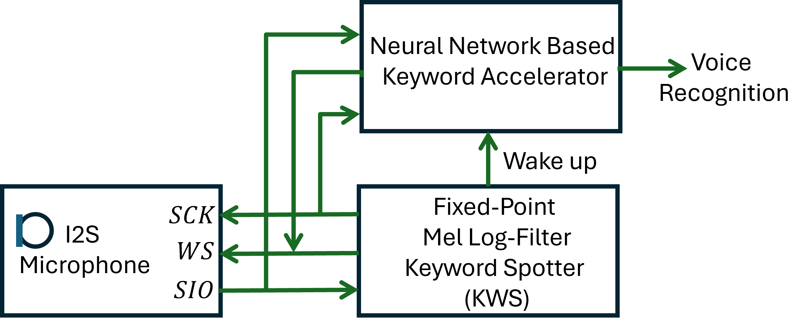

# Resources

- **LITERATURE**
  - **LLM-based HDL Generation**
    - Pearce H., et.al. _AutoChip: Automating HDL Generation Using LLM Feedback_ in DAC ’24([Link-To-Rxiv](https://arxiv.org/pdf/2311.04887))
    - Pearce H., et.al., “_DAVE: Deriving Automatically Verilog from English_,” MLCAD ’20. ([Link](https://dl.acm.org/doi/10.1145/3380446.3430634))
    - S. Thakur et al., “_Benchmarking Large Language Models for Automated Verilog RTL Code Generation_,” DATE'23 ([PDF](https://arxiv.org/pdf/2212.11140))

  - **Keyword Spotting**
    -  G. Sharma, wt.al., “_Trends in audio signal feature extraction methods_,” Applied Acoustics, vol. 158, p. 107020, Jan. 2020. ([PDF](https://calebrascon.info/AR/Topic4/addresources/features.pdf), [Link](https://doi.org/10.1016/j.apacoust.2019.107020)) : Nice summary article with a great summary of algorithms for feature extraction.
    - Y. Zhang, et.al., “_Hello Edge: Keyword Spotting on Microcontrollers_,” Feb. 14, 2018, arXiv ([PDF](https://arxiv.org/pdf/1711.07128) | [Link](https://arxiv.org/abs/1711.07128) | [Code GitHub Page](https://github.com/ARM-software/ML-KWS-for-MCU) | [PaperSwitchCode](https://paperswithcode.com/paper/hello-edge-keyword-spotting-on)) : KWS immplementation on resource-contrained microconrollers.
    - W. Han, et.al., “_An efficient MFCC extraction method in speech recognition_,” ISCAS, 2006, ([Link](https://doi.org/10.1109/ISCAS.2006.1692543) | [PDF](https://www.academia.edu/download/31107261/1660.pdf)) : An efficient algorithm to calculate the Mel-Frequency Cepstrum Coeffs (MFCC). 

- **USEFUL LINKS**
  - [Priyansu's KWS Github Page](https://github.com/Priyansu122/Project_keywordSpotter)
  - [Priyansu's RTL2GDS Github Page](https://github.com/Priyansu122/SI2024_RTL_TO_GDS)
  - [Priyansu's RTL2FPGA Github Page](https://github.com/Priyansu122/ASIC_FPGA_Design_Flow)

 
# Keyword Spotting (KWS) Architecture

Mel frequency cepstral coefficient (MFCC) features are widely used in applications such as keyword spotting (KWS) for extracting speech features such as a simple word "Alexa". In a typical all-digital immplementation, a digital microphone is used to read real-time data using an I2S serial interface. 

This project will aim to generate an entire hardware accelerator for the specific application of Keyword Spotting (KWS) using generative AI (gen-AI).

This project will target applications that are mostly dormant and are activated infrequently using a wake-up call such as "Wakeup Neo". It will also assume target applications to be very power conscious so it is using the bare minimum power when sleeping or dormant.

Keeping the above application in mind, we will target a two-step architecture where an ultra-low-power audio feature extraction algorithm will be implemented on a purely digital architecture, assuming that a digitized audio stream is provided as the input to this feature extractor while trading accuracy for power. This feature extractor will wake up an accurate hardware accelerator for KWS that can process a wide range of audio features more accurately, but at the expense of higher power consumption.

This project will not only demonstrate the use of Gen-AI to generate accurate hardware for high-performance applications, but also assist a non-expert as well. As analog designers, with minimal experience in digital design, we will take the help of gen-AI to come up with the right architecture for the above application with some skillful prompt engineering. Once the architecture has been verified to work with the above application, we will again take the help of Gen-AI to generate the hardware for the low-power feature extractor and the hardware accelerator for KWS. We will also use Gen-AI to assist designers in creating test plans for the generated design as well. It is understood that during the course of the project, the user will fine-tune the design without the help of gen-AI keeping it to as minimum as possible.

# Architecture

After initial interaction with Chat-GPT, the architecture for this project is as shown in the figure above. As mentioned in the abstract, this is a two-step architecture targeting that are mostly dormant and are activated infrequently using a wake-up call such as "Wakeup Neo". After initial interaction with Chat-GPT, we converged on a fixed-point Mel Log Filter to spot keywords. We want this filter to be consuming very little power at the expense of accuracy which is acceptable in this architecture. The microphone interface will be I2S, popular serial protocol for audio. The KWS will generate wake up call that will wakeup the keyword accelerator that can do complex voice recognition. 
