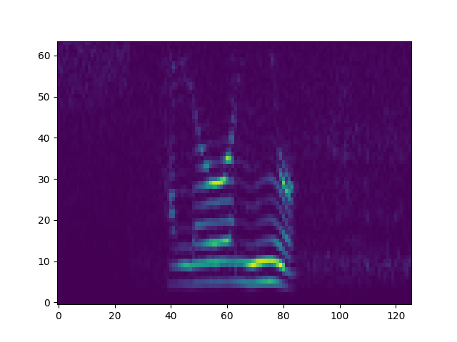
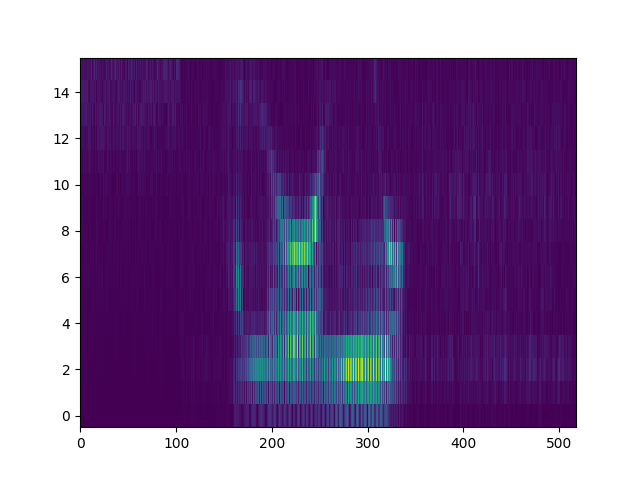

# mel-log.py

This script is used to the optimize the KWS architecture for minimum hardware. It models the first pre-emphasis filter (HPF), the hanning window and the FFT. The spectogram (FFT vs. time) is visually compared for different architecture parameters (HPF, no. of FFT points, overlap window, word width). The [wav input](hello_4K_8b.wav) is a band-limited (4kHz) 8-bit wide audio recording of the phrase "Hello Neo". The spectograms are compared for different parameters. For example the two figure below shows the spectograms for 128-point FFT vs. 32-point FFT. Although 128-point FFT is clearly more accurate, 32-point maybe enough for a low-accuracy KWS but the hardware saving is significant. 

_Figure: Spectogram of 128-pt FFT_

_Figure: Spectogram of 32-pt FFT_
